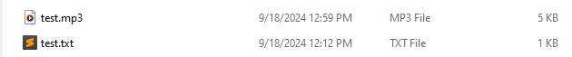

Follow this tutorial to learn how to use Write2Audiobook.

## Prerequisites

Before you begin:

1. [Download the scripts from GitHub][1]
1. [Install the required packages][2]

## Convert a text file to an audio file

1. Open a terminal window.
1. Clone the Write2Audiobook repo and go to the project's root directory.

    ```console
    git clone https://github.com/deangelisdf/write2audiobook.git
    cd write2audiobook
    ```

1. Run one of the scripts to convert a text file to an audio file.

    * To convert an ebook (`.epub`) to an English-language audio file:

      ```console
      python3 ebook2audio.py book.epub en
      ```

    * To convert a plain text file (`.txt`) to an English-language audio file:

      ```console
      python3 txt2audio.py text.txt en
      ```

    * To convert a Microsoft PowerPoint presentation (`.pptx`) to an English-language audio file:

      ```console
      python3 pptx2audio.py presentation.pptx en
      ```

    * To convert a Microsoft Word document (`.doc` or `.docx`) to an English-language audio file:

      ```console
      python3 docx2audio.py document.docx en
      ```

## Play the audio file

Write2Audio saves your audio file in the current directory. It has the same name as the converted file, but with a `.mp3` extension.



Listen to your audiobook with any program that can open MP3 or M4B files, like [VLC][3].

[1]: ./user-guide/download-scripts.md
[2]: ./user-guide/install-libraries.md
[3]: https://www.videolan.org/vlc/
