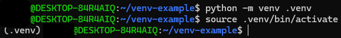

This page explains how to install the packages that you need to run the Write2Audiobook scripts.

## Prerequisites

All Write2Audiobook scripts are Python scripts. To run them, you need to have Python version 3.7 or higher installed on your computer.

Run the following command to see which Python version you have installed on your computer:

```console
python -v
```

If the command doesn't work or if your Python version's too low, install a new Python version. See the [Python Beginner's Guide][1] to learn how to download and install Python.

## Virtual environments

Virtual environments keep workspaces clean and isolated. They help to avoid conflicts with other libraries that you may install for other projects. If something happens to a library in a virtual environment, it keeps the damage to just one folder. That means you can uninstall any broken libraries with no impact on other workspaces.

### Create a virtual environment

Create a virtual environment for your Write2Audiobook project:

1. Open a terminal window.

    * If you use Windows, open a Command Prompt window.

1. Go to the Write2Audiobook project's root folder.

    ```console
    cd write2audiobook
    ```

1. Run the following command to create the virtual environment:

    ```console
    python3 -m venv .venv
    ```

This creates a virtual environment in new folder called `.venv`.

### Activate the virtual environment

Activate the virtual environment:

=== "PowerShell"
    ```powershell
    .venv\Scripts\Activate.ps1
    ```

=== "Command Prompt"
    ```bat
    .venv\Scripts\activate.bat
    ```

=== "Linux or macOS"
    ```console
    source .venv/bin/activate
    ```

When your virtual environment is active, you see `(.venv)` in front of your terminal's prompt.



### Exit the virtual environment

When you're done working, exit the virtual environment:

```console
deactivate
```

## Install the required libraries

The Write2Audio project requires several thrid-party Python libraries. To see the list of required libraries, open the [`requirements.txt`][2] file.

Install the libraries from the `requirements.txt` file:

1. Open a terminal window.

    * If you use Windows, open a Command Prompt window.

1. Go to the Write2Audiobook project's root folder.

    ```console
    cd write2audiobook
    ```

1. [Activate your virtual environment](#activate-a-virtual-environment).
1. Run the following command to install the required libraries:

    ```console
    python3 -m pip install -r requirements.txt
    ```

You get a confirmation message when the installation is complete.

To see a list of the libraries you installed this way, run the following command:

```console
python3 -m pip list
  ```

!!! important
    If you use a Linux system, you must install three additional system packages. Run the following command to install these packages:

    ```console
    sudo apt update && sudo apt install espeak ffmpeg libespeak1 -y
    ```

[1]: https://wiki.python.org/moin/BeginnersGuide/Download
[2]: https://github.com/deangelisdf/write2audiobook/blob/main/requirements.txt
